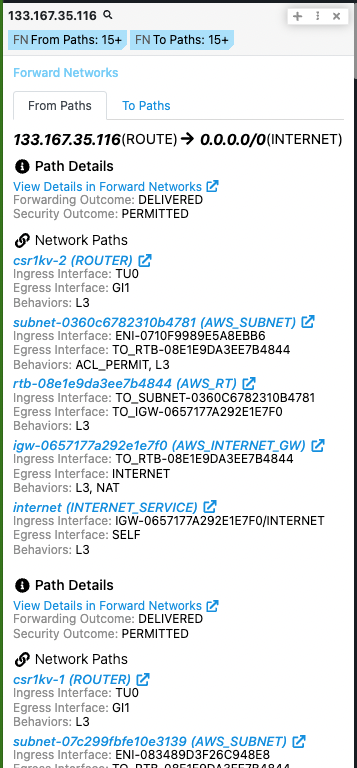

# Polarity - Forward Networks Integration

Explore what Forward Network can do for your network With one single platform, users can improve network security, query the network like a database, and finally gain visibility across instances.

The Polarity Forward Networks integration allows you to search Forward Networks by IP Addresses to get Network Path Information both To and From searched IP Addresses.

  

For more information on Forward Networks, please visit [official website](https://www.Forward Networks.com/).

## Forward Networks Integration Options
### Forward Networks API URL
The base URL of the Forward Networks API including the schema (i.e., https://)

### Forward Networks UI URL
The base URL of the Forward Networks UI including the schema (i.e., https://)

### Username
Your Username Credential

### Password
Your Password Credential
     
### Network ID Number
The 6-digit Network ID Number associated with the network you want to search your IPs on. (Found in Dashboard URL https://...?networkId=######)
     
### Snapshot ID Number
The 6-digit Snapshot ID Number associated with the network you want to search your IPs on. (Found in Dashboard URL https://...&snapshotId=######)
      
### Signal Source Query Type
When Querying IP Addresses, this determines if your search Network Paths Query is either To, From, or Both in relation to your Searched IP.

- (Default) Signal both To and From Searched IP
- Signal From Searched IP
- Signal To Searched IP"
  
### Signal Source IP Address
The IP Address you search other IP Addresses both to and from. Default `0.0.0.0/0` (i.e. Any Network Traffic)

## Installation Instructions

Installation instructions for integrations are provided on the [PolarityIO GitHub Page](https://polarityio.github.io/).

## Polarity

Polarity is a memory-augmentation platform that improves and accelerates analyst decision making.  For more information about the Polarity platform please see:

https://polarity.io/
